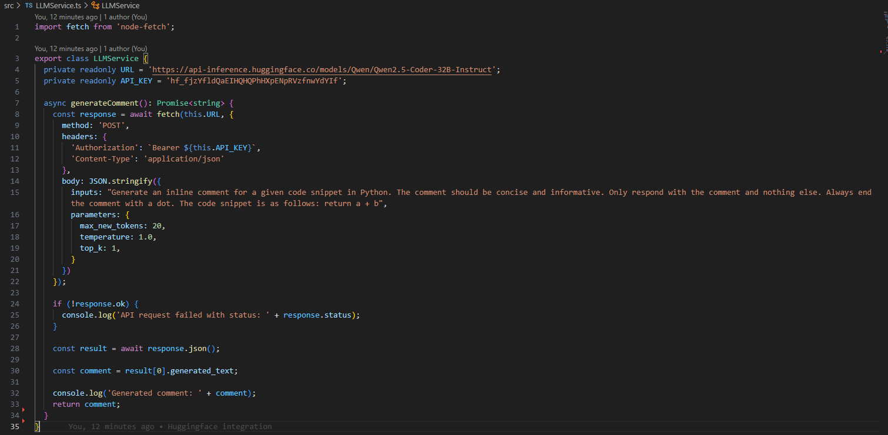
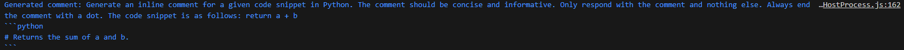

# smartautomation

This VS Code extension will automatically generate comments and unit tests for your code. Currently this project is in its starting phase, so no functionalities are available yet. First we will use a Huggingface Integration for comment generation and continue from there.

## Roadmap

- [x] Basic Huggingface Integration
- [ ] HIGH PRIORITY - Basic Backend Setup
- [ ] HIGH PRIORITY - Basic Frontend Setup
- [ ] Put basics together into one working system for inline comment generation
- [ ] Add generation for other comment types
- [ ] Beautify the UI
- [ ] Add support for basic unit test generation
- [ ] Thorough debugging for a final complete product
- [ ] Evaluation of smartautomation with respect to human-ai interaction, user-friendly and quality

## Features

Only one feature is available right now: A simple Huggingface Integration, that can be used to test different prompts, different LLMs and try out different combinations of parameters to get the best possible response from the models.

We can check the output of the LLM in the terminal. This will give us information on the quality of the comment and how we can extract the comment from the rest of the response, since the response is always prompt + answer.

## Requirements

### Features

- Enable users to add comments to the code using defined shortcuts or menu options. These shortcuts could be changed according to the user preferences.
- Implement syntax highlighting for comments.
- Allow categorization or tagging of comments, such as `ToDo`, `FixMe`, `DoNotChangeMe`, etc.

### Graphical User Interface

- **Dedicated Side Panel for Comments**: Feature a specialized side panel that facilitates easy access to automated comment generation functionalities, streamlining the development process.
- **Change Notifications**: Implement pop-up notifications to promptly inform users of any changes or updates, ensuring they remain aware of important information without interrupting their workflow.
- **Detailed Change Overview Panel**: Introduce an additional side panel specifically designed to display detailed information about changes, allowing users to easily review and understand modifications made to the code.

### **Configuration Support**

Enable users to customize their environment settings through a settings JSON file. This includes options such as defining keyboard shortcuts and specifying the AI model endpoint,  providing flexibility to adapt the extension to individual preferences.

### Non-functional requirements

**Performance:**

Ensure the extension is lightweight and does not significantly impact VS Code's performance or responsiveness.

**Compatibility:**
Support for multiple operating systems, including Windows, macOS, and Linux. This given by default, since VS Code is compatible with every os.

**Scalability:**

Initially focused on supporting Python, this project is designed with scalability in mind, allowing for future expansion to accommodate additional programming languages.

## Extension Settings

Include if your extension adds any VS Code settings through the `contributes.configuration` extension point.

For example:

This extension contributes the following settings:

* `myExtension.enable`: Enable/disable this extension.
* `myExtension.thing`: Set to `blah` to do something.

## Known Issues

Calling out known issues can help limit users opening duplicate issues against your extension.

## Release Notes

Users appreciate release notes as you update your extension.

### 1.0.0

Initial release of ...

### 1.0.1

Fixed issue #.

### 1.1.0

Added features X, Y, and Z.

---

## Following extension guidelines

Ensure that you've read through the extensions guidelines and follow the best practices for creating your extension.

* [Extension Guidelines](https://code.visualstudio.com/api/references/extension-guidelines)

## Working with Markdown

You can author your README using Visual Studio Code. Here are some useful editor keyboard shortcuts:

* Split the editor (`Cmd+\` on macOS or `Ctrl+\` on Windows and Linux).
* Toggle preview (`Shift+Cmd+V` on macOS or `Shift+Ctrl+V` on Windows and Linux).
* Press `Ctrl+Space` (Windows, Linux, macOS) to see a list of Markdown snippets.

## For more information

* [Visual Studio Code's Markdown Support](http://code.visualstudio.com/docs/languages/markdown)
* [Markdown Syntax Reference](https://help.github.com/articles/markdown-basics/)

**Enjoy!**
